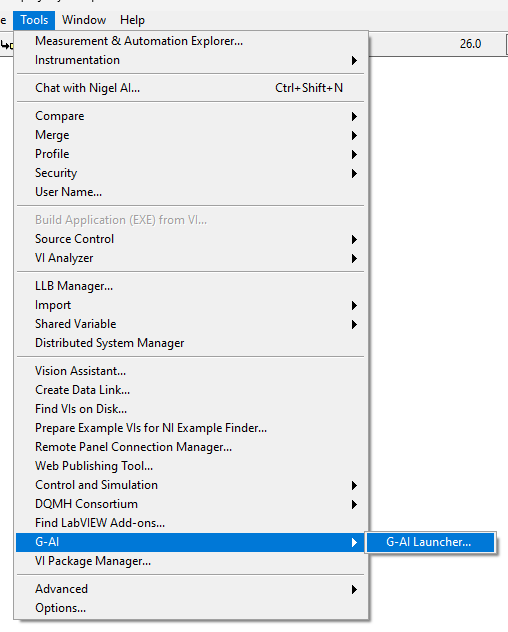
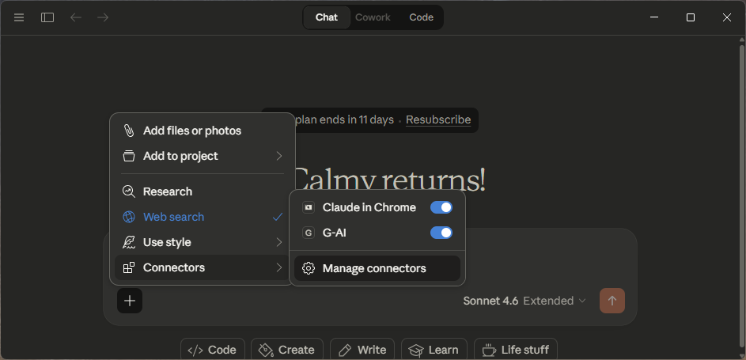
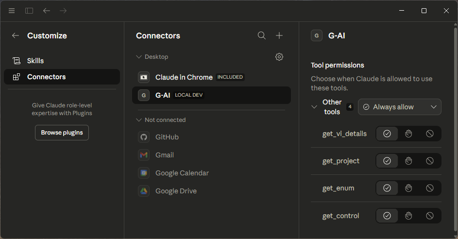

# G-AI
LabVIEW AI Assistant

## Overview
A LabVIEW MCP Server allowing you to query information from LabVIEW Code. It can read Project-, Library- and Class-Files and look at VI blockdiagrams. This way you can use a Large Language Model to "read" LabVIEW code and give advise on full projects.

## MCP Overview
MCP is a plugin-interface for Large Language Model Chatbots. An MCP Client is a Chat Application (e.g. Claude Desktop). An MCP Server is the Plugin itself providing the chatbot with functions (tools) that it can call during a conversation.

## MCP Example
If I have the MCP Server registered in Claude Desktop I can ask "Analyze this Project and tell me how to optimize it. C:/../test.lvproj". The Model will then propably call "get_project" multiple times to read the project file first and potentially all contained libraries. It will then call "get_vi_details" multiple times to get the description and block diagram screenshot of the most important VIs in the project. With all that information it can then provide guidance on the code.

## Installation
Install the latest vi package from builds/G-AI to include the launcher in your tools menu.

## MCP Installation
To use this tool you need to install an MCP client. Claude Desktop is the one this project was tested on. It has a free trial, but for extensive projects a paid subscription will be required, since this process will use many tokens.

Different MCP Clients have different ways of installing the servers. But mostly it runs down to a json config file that looks similar to this:

  "mcpServers": {
    "G-AI": {
      "command": "npx",
      "args": [
        "mcp-remote",
        "http://127.0.0.1:36987/mcp/server"
      ]
    }
  }

In Claude Desktop you can find this file through File -> Settings -> Developer -> Edit Config.
There might be multiple servers separated with comma in the "mcpServers" json element.
If you have issues modifying the file correctly, ask a chatbot of your choice for help, they'll know what to do.

Once the file is correctly formatted, you should see the Server in the Claude Desktop Settings -> Developer menu. If the server is running (run main.vi) it should show as "running" in that menu.

## Claude Code
In Claude code in a new chat window hit the "+" icon -> Connectors to see available connectors. G-AI should show up here and be activated.

When clicking "Manage Connectors" you can enable all tools to not require confirmation. This can also be done on the first time they're being used:

## Troubleshooting
To troubleshoot issues related to MCP servers in claude desktop (and other clients) there's usually a log-file tracking all mcp interactions for a specific server.